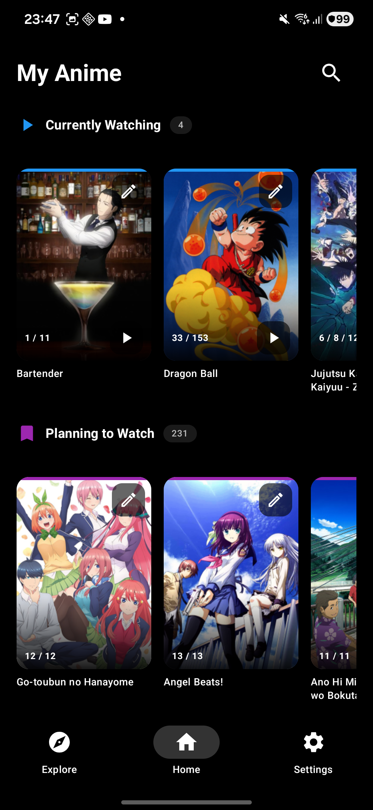
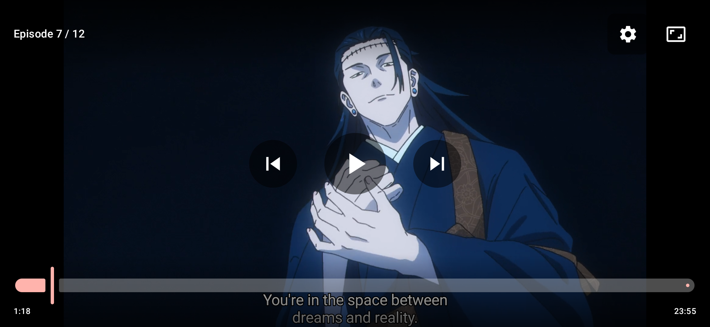
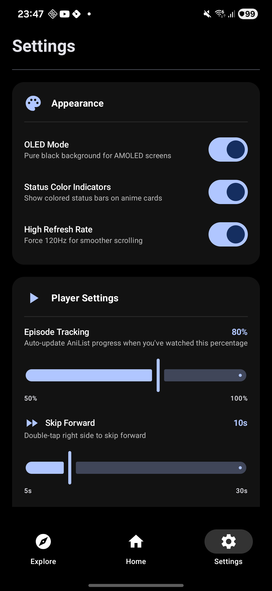

<div align="center">

# Darling

**A modern anime tracking and streaming app for Android with AniList integration.**


</div>

---

## Features

### Anime Tracking
- **AniList OAuth Login** – Secure authentication with your AniList account.
- **Full List Support** – View all your anime lists: Watching, Planning, Completed, On Hold, and Dropped.
- **Progress Tracking** – Automatically update your watch progress and sync with AniList.
- **Color-Coded Categories** – Each list type has its own distinct color for easy identification.
- **Quick Status Management** – Change anime status directly from cards with visual feedback.
- **Status Indicators** – Visual status bars on cards show your list status at a glance.
- **User Profile Display** – See your AniList avatar and username in settings.

### Explore and Discovery
- **Featured Carousel** – Auto-scrolling showcase of currently airing popular anime.
- **This Season** – See what's trending right now in the anime community.
- **Top Rated Series** – Browse highest-scoring TV anime of all time.
- **Top Rated Movies** – Discover top-rated anime films and features.
- **Genre Recommendations** – Browse anime by genre: Action, Romance, Comedy, Fantasy, and Sci-Fi.
- **Episode Info** – Accurate episode counts displayed in all anime detail dialogs.
- **Search** – Find any anime with debounced, real-time search and detail previews.

### Streaming and Video Player
- **Built-in Player** – Stream anime directly in the app using Media3 ExoPlayer.
- **Multi-Server Support** – Choose between different streaming sources for the best speed.
- **SUB/DUB Selection** – Switch between Subtitled and Dubbed versions on the fly.
- **Pre-fetched Streams** – Episodes fetched dynamically for seamless playback.
- **Auto Server Fallback** – Automatically switch to a working server if the current one fails.
- **Episode Navigation** – Seamless "Previous" and "Next" controls within the player.

#### Player Gestures and Controls
- **Customizable Skip Time** – Configure skip forward/backward duration (5-30 seconds).
- **Double-Tap to Skip** – Double-tap left side to rewind, right side to fast-forward.
- **Visibility** – Single tap to show or hide playback controls.
- **Precision Seek** – Interactive seek bar with real-time time display.
- **Aspect Ratio** – Toggle between Fit, Stretch, and 16:9 modes.
- **Subtitles** – Native support for VTT subtitle tracks.

### UI/UX
- **Material Design 3** – Modern, clean interface following the latest Android standards.
- **OLED Dark Mode** – Pure black theme designed to save battery on AMOLED screens.
- **High Refresh Rate** – Force 120Hz display mode for buttery smooth scrolling.
- **Swipe Navigation** – Smooth page transitions and intuitive gestures.
- **Responsive Layouts** – Fully optimized for both phone and tablet form factors.
- **Smooth Animations** – Visual feedback for all user interactions and state changes.
- **Smart Caching** – Data and images cached to prevent reloads and API rate limits.

---

## Category Colors

Each anime list category has a distinct color for easy visual identification:

| Category | Color | Description |
|:---------|:------|:------------|
| Watching | Blue | Currently watching |
| Planning | Purple | Plan to watch |
| Completed | Green | Finished watching |
| On Hold | Amber | Paused |
| Dropped | Red | Stopped watching |

---

## Screenshots

| Home Screen | Explore Screen | Video Player | Settings Screen |
|:---:|:---:|:---:|:---:|
|  |  |  |  |

---

## Requirements and Setup

- **Android Version:** 8.0 (API 26) or higher.
- **AniList Account:** Optional (required for tracking and list features).

### Installation
1. Download the appropriate APK from the [Releases](https://github.com/Suntrax/darling/releases) page:
   - **arm64-v8a** – For most modern devices (recommended)
   - **armeabi-v7a** – For older 32-bit devices
   - **universal** – Compatible with all devices (larger file size)
2. Enable **"Install from unknown sources"** in your Android settings.
3. Open the APK and install.

### Developer Configuration
To use your own **AniList OAuth** credentials:
1. Visit [AniList Developer Settings](https://anilist.co/settings/developer) and create a new client.
2. Set the Redirect URL to: `animescraper://success`
3. Update the `clientId` in `MainViewModel.kt`.

---

## Tech Stack

| Category | Technology |
|:---------|:-----------|
| **Language** | Kotlin |
| **UI Framework** | Jetpack Compose (Material 3) |
| **Architecture** | MVVM (Model-View-ViewModel) |
| **Networking** | OkHttp, Kotlinx Serialization |
| **Image Loading** | Coil (with memory and disk cache) |
| **Video Player** | Media3 ExoPlayer |
| **Async** | Kotlin Coroutines and Flow |
| **Data Storage** | SharedPreferences / DataStore Preferences |

---

## Project Structure

```
app/src/main/java/com/blissless/anime/
├── MainActivity.kt           # Main entry point and navigation
├── MainViewModel.kt          # State management and API calls
├── DarlingApplication.kt     # Coil image loader configuration
├── AnimeMedia.kt             # Core data models
├── api/
│   ├── AniListApi.kt         # AniList GraphQL API implementation
│   └── AniwatchService.kt    # Stream provider and scraper logic
├── ui/
│   ├── theme/                # Material 3 color schemes and typography
│   └── screens/              # UI Composables (Home, Explore, Player, Settings)
└── data/
    └── models/               # Kotlin data classes
```

---

## Changelog

### v1.6 (Current)
- **User Avatar Display** – Your AniList avatar now appears in the Settings screen.
- **Organized Settings** – Settings reorganized into Appearance and Player Settings sections.
- **Improved Caching** – Data cached for 5 minutes to prevent API rate limiting.
- **Image Caching** – All images cached to disk and memory for instant loading.

### v1.5
- **Customizable Skip Durations** – Set skip forward/backward time independently (5-30 seconds).
- **High Refresh Rate Mode** – New setting to force 120Hz for smoother scrolling.
- **Major Performance Overhaul** – Complete rewrite of Explore screen for buttery smooth scrolling.
- **Optimized Image Loading** – Disabled crossfade animations for instant image display.
- **Fixed Card Layout** – Anime cards no longer jump when scrolling horizontally.
- **Multi-ABI APKs** – Separate builds for arm64-v8a, armeabi-v7a, and universal.
- **Cleaner Defaults** – OLED mode and status colors now default to off.

### v1.4
- **Genre Recommendations:** Added browse-by-genre sections (Action, Romance, Comedy, Fantasy, Sci-Fi).
- **Enhanced Status Display:** Status indicators now show on anime cards and detail dialogs for all sections.
- **Episode Info Everywhere:** All anime detail dialogs now display accurate episode information.
- **Clean UI:** Removed icons from section headers for a cleaner look.
- **Improved Status Colors:** Added purple color for Planning list to differentiate from Watching.

### v1.3
- **Full List Support:** Added Completed, On Hold, and Dropped anime lists to Home screen.
- **Color-Coded Categories:** Each list type now has a distinct color for easy identification.
- **OLED Mode Fix:** Dark mode now properly applies across all screens.
- **Dialog Improvements:** "Saved" button in anime detail dialog now correctly removes anime from lists.
- **Visual Indicators:** Status bars on anime cards show list category at a glance.

### v1.2
- **Player Upgrades:** Added Server Selection and SUB/DUB support.
- **Reliability:** Implemented auto-server fallback and pre-fetched stream logic.
- **UX:** Instant login state restoration and improved tracking slider.
- **Stability:** Enhanced error handling and API connectivity patches.

### v1.1
- **Discovery:** Redesigned Explore page with Featured Carousel and new sections.
- **Functionality:** Added working "Remove from list" feature.
- **UI:** Added episode badges, animated bookmarks, and debounced search.
- **Fixes:** Improved episode counters for long-running series.

---

## API Reference
The app uses the **AniList GraphQL API** for:
- User authentication (OAuth 2.0 implicit flow)
- Fetching and updating user anime lists
- Real-time search and discovery

[AniList API Documentation](https://anilist.gitbook.io/anilist-apiv2-docs/)

---

## Contributing
1. **Fork** the repository.
2. **Create** your feature branch (`git checkout -b feature/AmazingFeature`).
3. **Commit** your changes (`git commit -m 'Add some AmazingFeature'`).
4. **Push** to the branch (`git push origin feature/AmazingFeature`).
5. **Open** a Pull Request.

---

<div align="center">

**Made with care for the Anime Community**

</div>